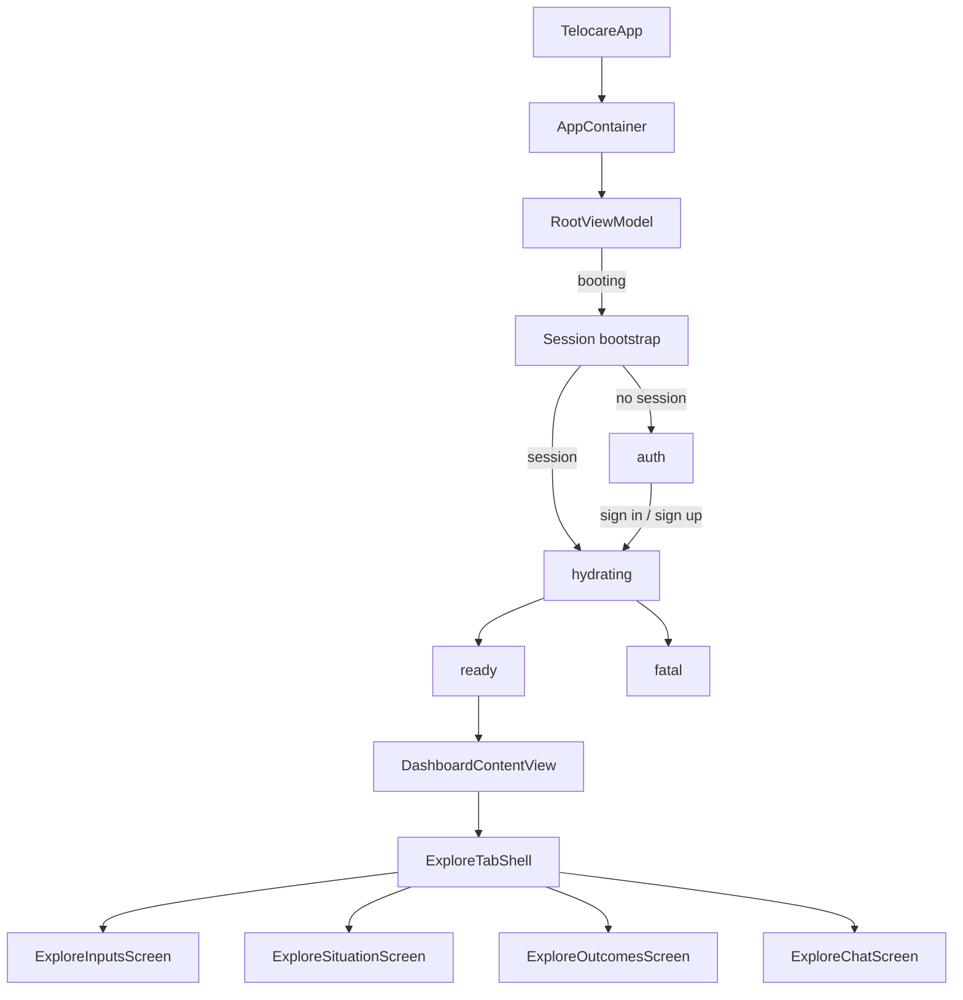

# Telocare iOS Current Logic Map

## Runtime flow

## Core orchestration boundaries

- `RootViewModel` owns auth intents and root state transitions.
- `SessionHydrationUseCase` owns hydration fetch, migration pipeline invocation, and migration side effects.
- `UserDataMigrationPipeline` owns canonical graph hydration and legacy migration decisions.
- `RootDashboardFactory` owns `AppViewModel` construction from hydrated `UserDataDocument`.
- `AppViewModel` remains the public feature coordinator, now delegating domain mutations to services in `Sources/App/Logic`.

## Mutation services under App

- `GraphMutationService`: graph node/edge deactivation + branch expansion patch preparation.
- `InputMutationService`: binary check-ins, dose mutations, dose settings, active intervention mutations.
- `MorningOutcomeMutationService`: morning questionnaire mutation + patch generation.
- `AppleHealthSyncCoordinator`: Apple Health reference labels/values and sync result normalization.
- `MuseSessionCoordinator`: Muse recording reliability mapping and session error normalization.

## UI decomposition

- `ExploreTabShell` now only composes tabs and bindings.
- Feature screens moved to:
  - `Sources/Features/Explore/Outcomes/*`
  - `Sources/Features/Explore/Situation/*`
  - `Sources/Features/Explore/Inputs/*`
  - `Sources/Features/Explore/Chat/*`
  - `Sources/Features/Explore/Shared/DetailRow.swift`
